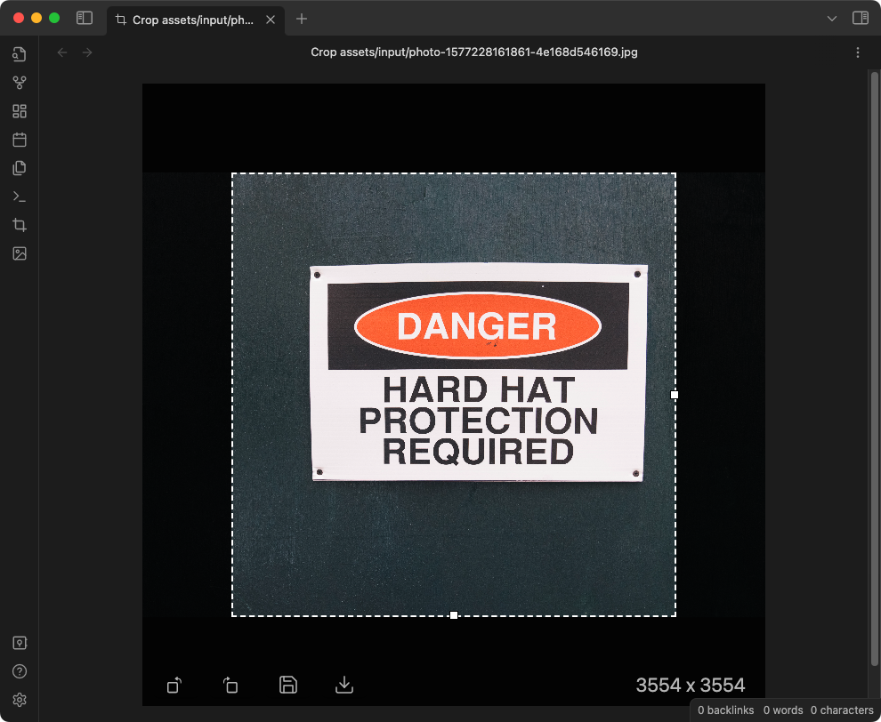
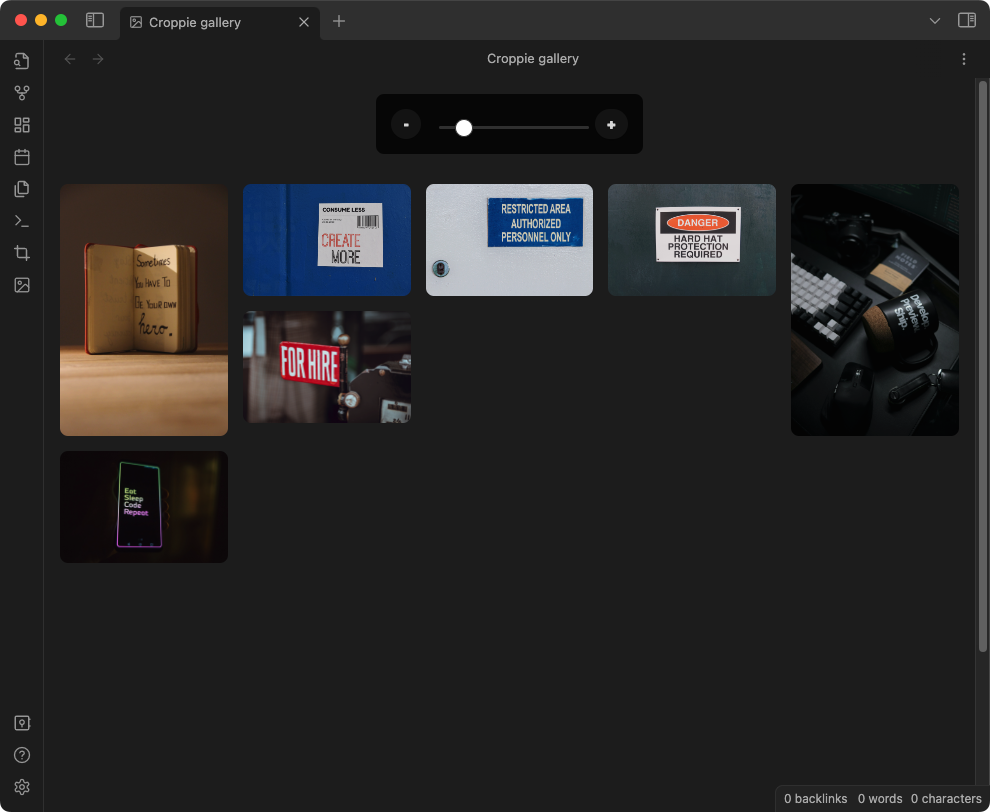
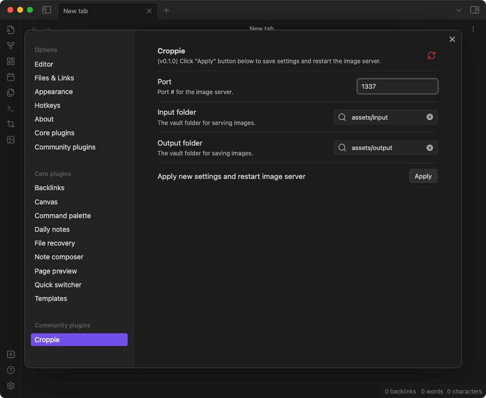

# Croppie 

## 🚧 W.I.P. pre-release BETA 🚧

[Croppie](https://github.com/Foliotek/Croppie) image cropper plugin for [Obsidian.md](https://obsidian.md)

## Screenshots

### Image cropping

### Gallery

### Plugin settings

## Commands

1. `Croppie: Crop an image`

## Ribbon actions

1. `Crop an image`
2. `Croppie image gallery`

## File menu actions

1. `Croppie: OCR this image`
2. `Croppie: crop this image`

## Install

### via Release download

Download pre-release beta plugin from: [croppie-for-obsidian-v0.1.0-beta.zip](https://github.com/gapmiss/croppie-for-obsidian/releases/download/0.1.0-beta/croppie-for-obsidian-v0.1.0-beta.zip) or [gapmiss/croppie-for-obsidian/releases](https://github.com/gapmiss/croppie-for-obsidian/releases)

Once downloaded to one's local machine, follow these steps to install:

1. extract the downloaded archive (`croppie-for-obsidian-v0.1.0-beta.zip`)
2. move the extracted folder/directory to `/path/to/vault/.obsidian/plugins`
3. In **Obsidian settings** > **Community plugins**, enable the **Croppie** plugin

### via BRAT (Beta Reviewer's Auto-update Tool)

1. Ensure [BRAT](https://github.com/TfTHacker/obsidian42-brat) is installed
2. Trigger the command `Obsidian42 - BRAT: Add a beta plugin for testing` 
3. Enter this repository, `gapmiss/croppie-for-obsidian`
4. Enable *Croppie* plugin in community plugin list

## Issues and bug reports

Please submit issues, bug reports, feature requests, etc. to [gapmiss/croppie-for-obsidian/issues](https://github.com/gapmiss/croppie-for-obsidian/issues)

## Development

1. `cd /path/to/vault/.obsidian/plugins`
2. `git clone https://github.com/gapmiss/croppie-for-obsidian.git`
3. `cd croppie-for-obsidian`
4. `npm install`
5. `npm run dev`

